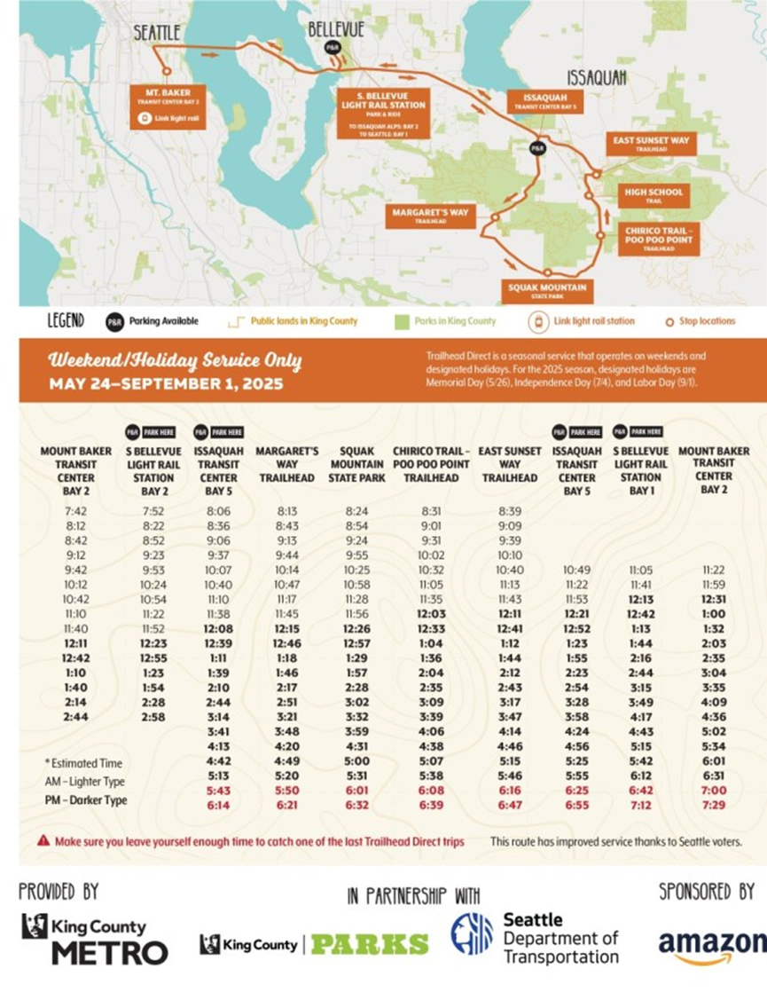
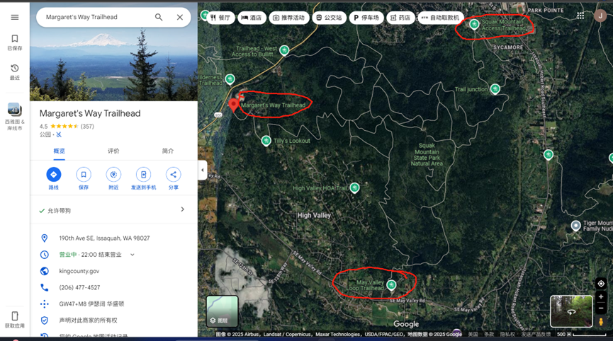
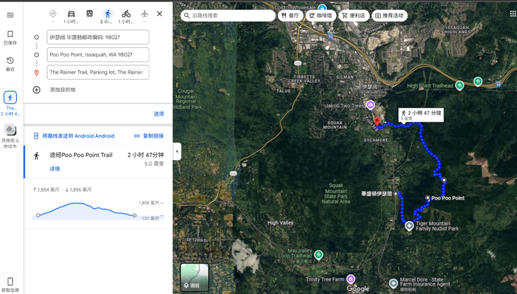

# TRILHEAD DIRECT徒步路线

## ROUTES 1: Issaquah Alps
* 该公交路线从轻轨1号线的MOUNT BAKER出发，经过2号线的South Bellevue站。首班车7:42，没半小时一班，最晚2:44。返回最晚6点多。

* 公交比较准时，提前到了会在站点等到发车时间再出发。

### 该路线和时刻表如下

## 该线路经过的Trails包括：Margaret’s Way, Chirico Trail-Poo Poo Point, Squak Mountain, the High School Trail, and East Sunset Way

# 方案1：Squak Mountain State Park Natural Area
## 看地图：可以从Margaret’s Way上去，May Valley Loop Trailhead（SQUAK MOUNT STATE PARK站）下来（大约4.7mile， 用时两个半小时），或者从 Squak Mountain Access Trailhead（High School站）下来（大约6mile，三个小时）。也可以从May Valley Loop Trailhead上去，从High School那边下来（4.3mile，2多小时）。下面都是Trailhead Direct的公交站。

# 方案2：Poo Poo Point（PPP）
## 从PPP站下车，走Chirico Taril到PPP，从high school trail下来（5mile，约3个小时）。
* 上山看Mt Rainier 和Paragliding，风景不错，但是路比较陡。下山从high school trail下来比较缓和，好像下山也不会想看什么风景了
